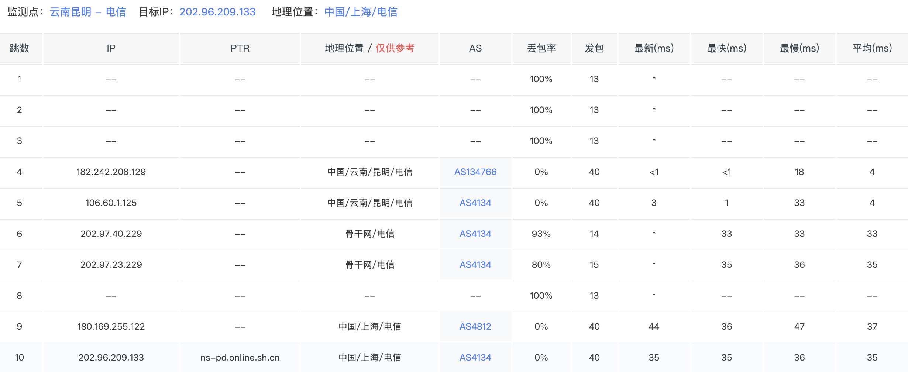
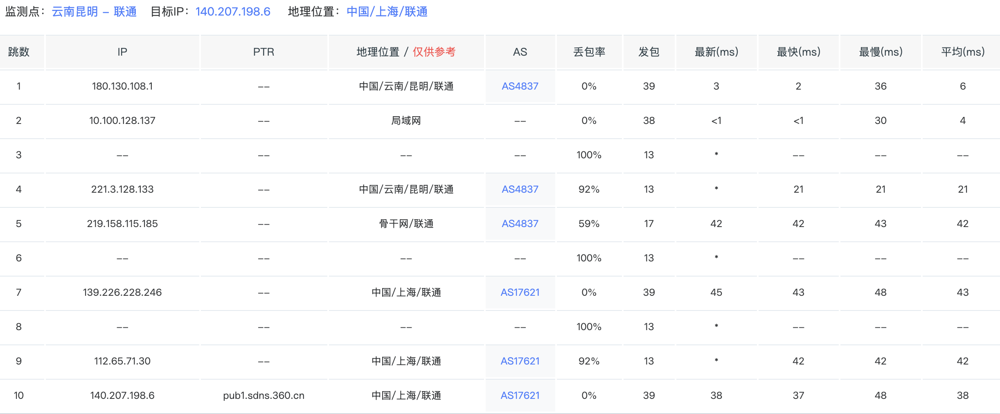
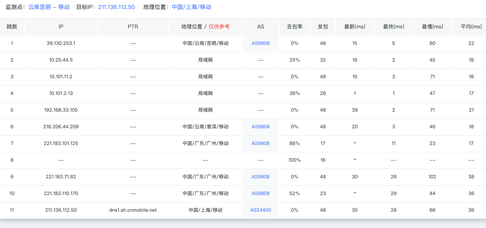

目前，中国市场上主要有四家运营商，分别是，中国电信，中国联通，中国移动，以及广电

<!--more-->

# 中国网络运营商概览

目前，中国市场上主要有四家运营商，分别是中国电信、中国联通、中国移动，以及广电。前三者长期以来都是中国最主要的运营商，而广电于 2019 年拿到了 5G 牌照，直到 2022 年才正式商用。在此之前，普通人能接触到的业务都是传统广播电视以及宽带业务。

在中国市场上，你会发现一个很奇怪的问题：大型的互联网公司，比如腾讯、阿里巴巴在国内的机房都依托三大运营商高额的网络开展其业务。除此之外，中国人如果需要玩服务器位于境外的游戏，大多需要使用游戏加速器（比如 Apex、Fortnite）。在中国，流畅访问境外的服务器资源是一项增值服务。

三大运营商在境外都会建设一套独立的精品网来支撑其业务，当然这张网也会有国内的节点；而国内的基础业务以及一般线路，则是另一张网。

---

## 中国主干网情况

中国三大运营商都有自己的主干网，而广电则大多依托广播电视线路。但在很多情况下，可以发现广电的路由会串到电信去。

下面分别介绍各运营商情况。

---

### 中国电信

中国电信拥有中国最大的骨干网，绝大部分情况下，从偏远地区访问内地资源在 RTT 表现上都很有优势。例如昆明 → 上海，实测相较中国联通和中国移动的延迟要低不少。

测试如下：

- 上海电信 DNS：`202.96.209.133`
- 上海联通 DNS：`140.207.198.6`
- 上海移动 DNS：`211.136.112.50`

测试方法为通过 itdog 从不同运营商的昆明节点 MTR 到对应运营商在上海地区的 DNS。

测试结果如下：

  
  

实测下来，电信结果显著优于联通以及移动。

主要业务承载网络为 **AS4134**，即 **163 网**。上面的测试已经体现出电信骨干网的优秀。

国际精品网业务承载网络为 **AS4809**，也就是知名的 **CN2**，面向海外业务的标杆产品。但 CN2 也分等级，例如 **CN2 GIA** 与 **CN2 GT**。

判断方法如下：

- CN2 GIA 全程路由节点均为 `59.43.*.*`
- CN2 GT 可能在国内节点混用 163 网路由，节点中会有 `202.97.*.*`

---

### 中国联通

中国联通拥有中国第二优秀的骨干网。

主要业务承载网络为 **AS4837**。得益于联通较少的用户数，这张网络在某些地区表现甚至远优于 163 网。

国际精品网业务为 **AS9929** 和 **AS10099**，其中 **AS10099** 主要负责国际线路连接。对标电信的 **CN2 GIA**，而某些时候表现甚至优于 CN2 GIA。

---

### 中国移动

主要业务承载网络为 **AS9808**。目前来看已经算不错了，但早些年甚至处于“能不能用”的状态，打国内游戏都可能丢包。

国际精品网业务承载网络为 **AS58453**，相较前两者有明显的价格优势，但质量上与 AS9929 以及 CN2 存在较大差距。

除此之外，移动新建了一个对标 CN2 / 9929 的网络 **CMIN2**，AS 号为 **AS58807**，但目前来看仍追赶不上前两者。

---

## 互联网交换中心

### CNIX

目前深圳、上海、杭州、中卫都有互联网交换中心，但相较国际主流 IX 仍有不小的差距。

以下为深圳前海互联网交换中心的情况（可访问 `https://www.cnix.cn/`）：

- 实时：`1201.12 Gb/s`
- 峰值：`2517.37 Gb/s`
- 最近 2 天数据

---

## 宽带运营商

由于中国的特殊情况，主要宽带运营商仍是三大运营商。除此之外，还有广电、鹏博士、长城宽带之类。

如果要分级：

- **T1**：电信、联通
- **T2**：移动
- **T3**：其他少量民营运营商

常见说法有“北联通，南电信”，但实际上大多数地区两者差距并不大，电信可能整体稍强一些。移动受益于低价（某些地区甚至免费送），用户数量非常庞大。

---

## 境外访问

参考前文。根据个人体验：

- 电信境外表现相对垫底（普通线路）
- 移动在某些目标地区优于联通
- 香港方向：移动表现最佳
- 日本方向：联通通常更优秀
- 电信如果不是访问美国等特定地区，基本需要精品网才能保证质量

事实上，电信 **AS4134** Peers 非常多，远高于联通与移动，但由于用户极多，体验相对较差。

可参考以下 Peers 列表：

- 电信（AS4134）：`https://bgp.he.net/AS4134#_peers`
- 联通（AS4837）：`https://bgp.he.net/AS4837#_peers`
- 移动（AS9808）：`https://bgp.he.net/AS9808#_peers`

如果需要更精确分析，还应查看国际精品网的 peers。例如移动境外多走 **AS58453** 和 **AS58807**，而电信与联通则在原本网络上接入大量境外 peers。

---

## 移动网络运营商

大部分情况下：

- 移动信号最好
- 其次电信
- 最后联通

由于广电共用移动基站，因此广电信号表现与移动一致。

电信与联通在资费方面相对移动更具优势。

---

## 公开数据参考

- 5G 用户：中国移动超 5.5 亿、中国电信超 3.5 亿、中国联通近 2.9 亿
- 固网宽带：中国移动超 3.1 亿、中国电信超 1.97 亿、中国联通约 1.21 亿

无论固网还是宽带，移动用户数都遥遥领先。拥有客户意味着拥有巨量资源，未来仍具成长空间。

---

## 一些设想

目前，中国也在逐步开放电信市场。未来，希望能够用上更便宜的国际互联网服务。但由于众所周知的原因，个人感觉仍有一定难度。

二十年前，许多游戏服务器甚至是单线网络，跨网延时巨大。很难想象二十年后的今天，互联网能给生活带来如此巨大的改变。希望下一个十年，接入普遍能到10Gbps，正式进入云上的时代。
