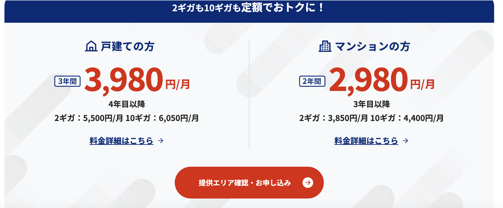

日本上网指南（不完全）

<!--more-->

# 日本网络运营商概览：主干网、宽带与移动网络

不同于中国三大网络运营商垄断的局面，日本有着各种各样的本土运营商，以及国际互联网厂商提供的多样化服务。  
本文将从 **主干网运营商、宽带运营商、移动运营商** 三个方面进行简单梳理。

---

## 一、日本主干网运营商

### NTT（AS2914）
整个亚洲当之无愧的一哥，日本最大的主干网络运营商。  
基于其自有主干网络，提供数据中心接入、家庭宽带以及移动互联网业务（docomo）。

### KDDI（AS2516）
日本主要主干网运营商之一，业务覆盖范围与 NTT 类似，  
同时运营移动互联网品牌 **au**。

### SoftBank（AS17676）
软银旗下的网络运营商，同样拥有自己的主干网络，并涉足移动互联网业务。

> 以上三家运营商，在东京都厅展望台都可以看到对应的大楼。

---

### Internet Initiative Japan（IIJ，AS2497）
日本顶级骨干网运营商之一，但在普通民众中的存在感不强。  
主要业务面向 **企业与数据中心**，  
似乎并未直接提供家庭宽带或移动互联网服务。

### ARTERIA Networks（AS2519）
较为老牌的运营商之一，  
**Ucom 光** 似乎是其旗下的宽带品牌。

---

### 日本的互联网交换中心（IX）

日本拥有多个重要的 IX，例如：

- JPIX  
- BBIX  
- JPNAP  

日本几乎所有主要机房中，也能看到国际大型网络运营商的接入，例如 **Tata、Lumen** 等，这里不再展开。

---

## 二、宽带运营商

绝大部分宽带运营商属于 **二级运营商**，  
直接租用 NTT 等主干网进行传输。

由于运营商数量众多，这里仅列举一些较为常见的。

---

### NURO 光

索尼旗下 **So-net** 的宽带品牌。  
可提供高达 **10Gbps** 的接入速率，且价格相当亲民。

例如：  
10G 带宽仅需 **4,400 日元 / 月**。  
在日本主要大城市基本都有覆盖，是否可办理取决于公寓是否支持。

个人认为是办理宽带的首选。

测试 IP：`202.213.193.49`（非终端 IP）  
接入为 **Sony 系自建光纤**，骨干及对等可能与 NTT / KDDI 等互联。

---

### NTT 光 / docomo 光 / ahamo 光

均使用 **NTT 的线路**。

测试 IP：`61.200.80.90`（非终端 IP）

---

### au 光

KDDI 旗下宽带品牌。  
大部分流量应走自有线路，原则上不依赖 NTT。

---

### SoftBank 光

软银旗下宽带品牌。  
实测打《王者荣耀》几乎不卡，延迟表现非常好。

测试 IP：`219.188.225.22`

---

### J:COM

在老房子中比较常见，  
有些公寓甚至是 **免费附带** 的宽带服务。

---

### eo 光

在大阪地区较为常见，  
个人使用不多。

---

### コミュファ光

在名古屋地区遇到过，  
不太清楚具体归属品牌。

---

### Ucom 光

不太确定具体属于哪家运营商。

---

## 三、移动运营商

### docomo

NTT 旗下的移动运营商，一哥地位稳固，  
几乎 **任何地方都有信号**。

---

### SoftBank

体感上与 docomo 差异不大，  
即使在山里通常也能正常使用。

---

### au

与前两家差距不明显，  
大多数使用场景下体验接近。

---

### 乐天（Rakuten Mobile）

不到 **3000 日元不限流量**，性价比极高。  
但信号相对较弱，即使在城市中，某些角落也可能信号较差。

如果长期生活在东京，个人感觉仍然是 **非常值得考虑** 的选择。

---

### 其他虚拟运营商（MVNO）

例如：

- CMlink  
- IIJmio  
- mineo  

这类运营商数量很多，  
基本都租用 docomo 等大运营商的基站。

因此在 **信号与速度** 上，可以直接参考所依附的主运营商。

---

## 四、个人选择建议

对我来说，如果去日本：

- **宽带首选**：NURO 光  
- **移动运营商**：大概率仍然选择 docomo
